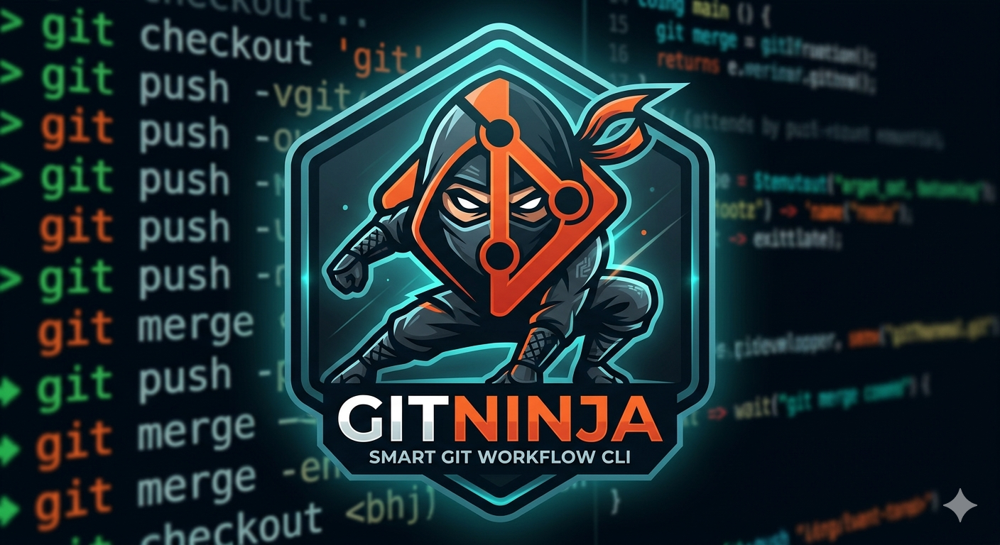

<p align="center">
  
</p>

<h1 align="center">GitNinja</h1>
<p align="center">Smart Git Workflow CLI — because writing code is hard enough.</p>

GitNinja is a developer-focused CLI tool that automates the entire Git branch lifecycle. Instead of typing multiple Git commands for every routine operation, you run one simple command — or just open the interactive menu and pick what you want to do.

---

## The Problem GitNinja Solves

Every developer does this dozens of times a day:

```bash
# Starting work
git checkout main
git pull origin main
git checkout -b feature/my-task

# Saving work
git add .
git commit -m "update something"
git push origin feature/my-task

# Staying up to date
git stash
git checkout main
git pull origin main
git checkout feature/my-task
git merge main
git stash pop
git push origin feature/my-task
```

**GitNinja replaces all of that with:**

```bash
gitninja start     # handles the first block
gitninja save      # handles the second block
gitninja sync      # handles the third block
```

---
## Build Instructions

Add this to your project structure and build process:

```bash
# Build your self-contained exe first
dotnet publish -c Release -r win-x64 --self-contained true -p:PublishSingleFile=true

# Download Inno Setup (free): https://jrsoftware.org/isdl.php
# Then compile the installer:
"C:\Program Files (x86)\Inno Setup 6\ISCC.exe" GitNinja-Installer.iss
```

## Installation

### Option 1 — Download the Release EXE (Recommended for most users)

> No .NET installation required. Everything is bundled in one file.

1. Go to the [Releases page](https://github.com/srvbiswas07/gitninja/releases)
2. Download the latest version for your OS:
   - `GitNinja-win-x64.exe` — Windows
   - `GitNinja-linux-x64` — Linux
   - `GitNinja-osx-x64` — macOS
3. Follow the setup steps for your OS below.

---

### Windows Setup

1. Download `GitNinja-win-x64.exe` from the [Releases page](https://github.com/srvbiswas07/gitninja/releases)
2. Run the installer (double-click)
3. Follow the prompts — the installer will:
   - Install GitNinja to `C:\Program Files\GitNinja\`
   - Automatically add it to your PATH
   - Check if Git is installed (and offer to download if not)
   - Create Start Menu shortcuts

4. Open a **new** Command Prompt or PowerShell and run:

```bash
gitninja
```

You should see the GitNinja banner and menu. Done!

---

### Linux Setup (After Download)

```bash
# Make it executable
chmod +x GitNinja-linux-x64

# Move to a folder already in PATH
sudo mv GitNinja-linux-x64 /usr/local/bin/gitninja

# Verify
gitninja
```

---

### macOS Setup (After Download)

```bash
# Make it executable
chmod +x GitNinja-osx-x64

# Move to a folder already in PATH
sudo mv GitNinja-osx-x64 /usr/local/bin/gitninja

# If macOS blocks it (Gatekeeper), allow it
xattr -d com.apple.quarantine /usr/local/bin/gitninja

# Verify
gitninja
```

---

### Option 2 — Install as a .NET Global Tool (For developers)

If you already have the .NET 8 SDK installed:

```bash
dotnet tool install --global GitNinja
```

This makes `gitninja` available from any terminal automatically.

```bash
# Update later
dotnet tool update --global GitNinja

# Uninstall
dotnet tool uninstall --global GitNinja
```

---

### Option 3 — Build from Source

```bash
# Clone the repo
git clone https://github.com/srvbiswas07/gitninja.git
cd gitninja

# Run directly without building
dotnet run

# Build a self-contained single exe (no .NET required on target machine)
dotnet publish -c Release -r win-x64 --self-contained true -p:PublishSingleFile=true
dotnet publish -c Release -r linux-x64 --self-contained true -p:PublishSingleFile=true
dotnet publish -c Release -r osx-x64 --self-contained true -p:PublishSingleFile=true
```

Output will be in:
```
bin/Release/net8.0/win-x64/publish/GitNinja.exe
```

---

## How to Use GitNinja After Installing

### Step 1 — Open a terminal

**Windows:**
- **Command Prompt** — press `Windows + R`, type `cmd`, press Enter
- **PowerShell** — press `Windows + X`, click Windows PowerShell
- **VS Code terminal** — press `Ctrl + backtick` inside VS Code

**Linux / macOS:**
- Open your terminal application

---

### Step 2 — Navigate to your project folder

```bash
# Windows
cd C:\MyProjects\my-app

# Linux / macOS
cd ~/projects/my-app
```

> **Tip:** In VS Code, if you open a project folder and use the built-in terminal, you are already in the right place. Just type `gitninja`.

---

### Step 3 — Run GitNinja

```bash
gitninja
```

GitNinja will automatically:
1. Check if Git is installed — if not, offer to open the download page
2. Check if you are inside a Git project — if not, let you browse to one or initialize a new repo
3. Show your current branch and uncommitted file count
4. Display the interactive arrow-key menu

---

### The Interactive Menu

```
        _____ _ _   _   _ _
       / ____(_) | | \ | (_)
      | |  __ _| |_|  \| |_ _ __  _  __ _
      | | |_ | | __| . ` | | '_ \| |/ _` |
      | |__| | | |_| |\  | | | | | | (_| |
       \_____|_|\__|_| \_|_|_| |_| |\__,_|

        Smart Git Workflow CLI - v1.0

  Branch:       feature/user-auth
  Changes:      2 file(s) not committed
  --------------------------------------------

  What do you want to do?
  > start    >>  Create new branch from latest main
    save     >>  Stage, commit and push my changes
    sync     >>  Pull latest main into my branch
    status   >>  Show branch and file status
    cleanup  >>  Delete merged branches
    undo     >>  Undo last commit safely
    help     >>  Show all commands
    exit     >>  Quit
```

Use **arrow keys** to move. Press **Enter** to select. No typing needed.

---

### Running Commands Directly (Skip the Menu)

You can also run any command directly without opening the menu:

```bash
gitninja save
gitninja sync
gitninja status
gitninja start
gitninja cleanup
gitninja undo
gitninja help
```

---

## All Commands

| Command | What it does |
|---|---|
| `gitninja start` | Create a new branch from latest main |
| `gitninja save` | Stage, commit and push your changes |
| `gitninja sync` | Pull latest main and merge into your branch |
| `gitninja status` | Show branch state and changed files |
| `gitninja cleanup` | Delete all merged branches |
| `gitninja undo` | Safely undo the last commit |
| `gitninja help` | Show all commands |

---

### Preview Mode

Add `--preview` to any command to see exactly what Git commands will run — without executing anything:

```bash
gitninja save --preview
gitninja sync --preview
gitninja start --preview
```

Example:
```
  >>  Preview - these commands will run:
      git add .
      git commit -m "Update user authentication service"
      git push origin feature/user-auth
```

---

## Core Workflows

### Starting Work (`gitninja start`)

- **Already on a feature branch?** — Nothing to do, you are ready to code.
- **On main/master/develop?** — GitNinja will pull latest, ask for a branch name, and create it.

```
  >>  You are on 'main' - a new branch will be created.
  Branch name: feature/user-auth
  >>  Pulling latest from origin/main...
  [OK]  Switched to new branch 'feature/user-auth' - start coding!
```

---

### Saving Work (`gitninja save`)

Stages all changes, suggests a commit message, then pushes — all in one step.

```
  >>  Files to be committed (3):
       M   src/auth.service.ts
       M   src/login.component.ts
       ??  src/auth.helper.ts

  Commit message:
  > Use suggested: "Update auth service and login component"
    Write my own message

  [OK]  All changes staged
  [OK]  Committed: "Update auth service and login component"
  [OK]  Pushed to origin/feature/user-auth
```

**Protected branch guard:** Committing directly to `main`, `master`, `develop`, or `dev` is blocked automatically.

---

### Syncing with Main (`gitninja sync`)

```
  [OK]  Changes stashed
  [OK]  Got latest main
  [OK]  Merged main into feature/user-auth
  [OK]  Stashed changes restored
  [OK]  Branch 'feature/user-auth' is now up to date with main!
```

If a merge conflict is detected, GitNinja pauses and lists the conflicted files.

---

### Branch Cleanup (`gitninja cleanup`)

```
  Branch              State
  ------------------------------------------
  feature/user-auth   Merged - safe to delete
  fix/login-bug       Merged - safe to delete

  [WARN]  Delete 2 merged branch(es)? [y/n]
  [OK]  Deleted local and remote 'feature/user-auth'
  [OK]  Done - 2 branch(es) removed.
```

---

### Undo Last Commit (`gitninja undo`)

```
  [WARN]  Last commit: a3f2c1 - Update login flow
  [WARN]  This will undo your last commit. Changes will be kept but uncommitted.
  Are you sure? [y/n]
  [OK]  Last commit undone - changes are still here, ready to re-commit.
```

---

## Safety Rules

GitNinja never runs a destructive command without confirmation:

| Situation | What GitNinja does |
|---|---|
| Committing to main/master | Blocks and asks you to create a branch |
| Uncommitted changes before sync | Auto-stashes, syncs, then restores |
| Merge conflict detected | Pauses and lists conflicted files |
| Undo last commit | Shows the commit and asks for confirmation |
| Branch deletion | Lists branches and asks for confirmation |
| Detached HEAD | Blocks and explains the situation |
| Git not installed | Offers to open download page or show install guide |

---

## Building the Release EXE

To build a single file with .NET bundled in (no installation needed on target machine):

```bash
# Windows
dotnet publish -c Release -r win-x64 ^
  --self-contained true ^
  -p:PublishSingleFile=true ^
  -p:IncludeNativeLibrariesForSelfExtract=true

# Linux
dotnet publish -c Release -r linux-x64 \
  --self-contained true \
  -p:PublishSingleFile=true

# macOS
dotnet publish -c Release -r osx-x64 \
  --self-contained true \
  -p:PublishSingleFile=true
```

Output:
```
bin/Release/net8.0/win-x64/publish/GitNinja.exe      (Windows)
bin/Release/net8.0/linux-x64/publish/GitNinja        (Linux)
bin/Release/net8.0/osx-x64/publish/GitNinja          (macOS)
```

The published file is fully self-contained. Target machine does not need .NET installed.

---

## Project Structure

```
GitNinja/
├── assets/
│   ├── gitninja.png        ← used in README + GitHub
│   ├── gitninja.ico        ← used for .exe icon
│   
├── Program.cs                    Entry point + interactive menu
├── GitNinja.csproj
│
├── Commands/
│   ├── StartCommand.cs           gitninja start
│   ├── SaveCommand.cs            gitninja save
│   ├── SyncCommand.cs            gitninja sync
│   ├── StatusCommand.cs          gitninja status
│   ├── CleanupCommand.cs         gitninja cleanup
│   └── UndoCommand.cs            gitninja undo
│
├── Core/
│   ├── GitRunner.cs              Git CLI wrapper
│   └── ContextAnalyzer.cs        Reads repo state
│
└── Services/
    ├── SafetyService.cs          Branch protection + confirmations
    ├── SuggestionService.cs      Auto commit message generator
    └── OutputService.cs          Colored terminal output via Spectre.Console
```

---

## Tech Stack

| | |
|---|---|
| **Language** | C# / .NET 8 |
| **CLI Output** | Spectre.Console |
| **Git Execution** | System.Diagnostics.Process |
| **Distribution** | Self-contained single file exe |
| **Platform** | Windows, Linux, macOS |

---

## Roadmap

- [x] Core commands: start, save, sync, status, cleanup, undo
- [x] Safety layer with protected branch detection
- [x] Auto commit message suggestion
- [x] Interactive arrow-key menu
- [x] Preview mode (--preview)
- [x] Self-contained exe with no .NET dependency
- [x] Git not installed detection with guided setup
- [ ] AI-powered commit messages via optional API key
- [ ] .gitNinja.json config file per repo for custom branch names and rules
- [ ] VS Code extension wrapping the same CLI logic
- [ ] Plugin system for team-defined custom commands

---

## Contributing

Pull requests are welcome. For major changes please open an issue first to discuss what you would like to change.

---

## License

MIT

---

> Made for developers who just want to write code.